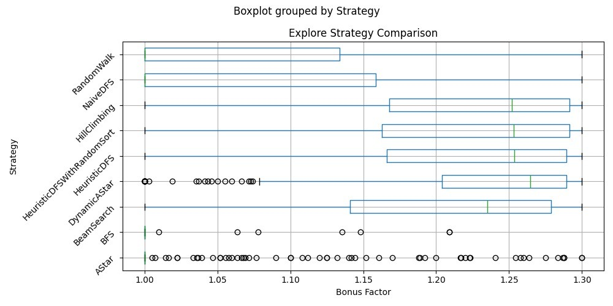

# Software Design and Programming Coursework

## [Wiki](https://github.com/Izzywa/Software-design-and-programming-Coursework/wiki/Home)

## Handy repo-wide shortcuts

These Gradle tasks are committed to the repository, so everyone who clones it can use the same short commands from the repo root:

```bash
./gradlew txt   # run the text interface
./gradlew gui   # run the GUI interface
./gradlew clean build
```

arguments could be added to the end of these commands as needed, for example:

```bash
./gradlew txt --args="-n 100" # run in headless mode with 100 iterations
./gradlew gui --args="-s 1050" # run the GUI with a custom seed
```

## Verify build success
Run in terminal:
```bash
./gradlew clean build
```
note: _there will be some warnings from problems in the code base but the terminal should show output like_
```bash
BUILD SUCCESSFUL in 5s
9 actionable tasks: 9 executed
```

# Tests
The test classes are located in `temple/src/test/java/` and are configured to run with JUnit 5. You can run all tests using Gradle with the following command:

```bash
./gradlew test
```

# Generating JavaDoc
Run the following command in terminal
```bash
./gradlew javadoc
```

You can view the documentation in the following file `temple/build/docs/javadoc/index.html`

# Strategies considered
Currently, the plot for the different strategies performance need to be generated manually. Run the following command in the terminal

```bash
 python3 python/PlotExploreComparisonGraph.py 
```
OR
```bash
 python python/PlotExploreComparisonGraph.py 
```

## 1. System Overview

The system is designed to navigate a dynamic and unknown graph environment to retrieve a target object (the "Orb") ("the exploration phase") and subsequently escape from another dynamic but fully revealed graph environment while collecting rewards (gold) before the time constraint is exceeded ("the escape phase").

Because the environment remains unknown throughout the exploration phase, real-time discovery and memory of the visited locations are necessary. Furthermore, a score multiplier is earned during the exploration phase which is inversely proportional to the steps taken to retrieve the Orb. This multiplier is applied to the gold collected during the escape phase to determine the final score. Therefore, the pathfinding logic during the exploration phase aims at minimising the total steps taken to retrieve the Orb.

While the environment is fully revealed during the escape phase, the pathfinding logic must balance the requirement of timely evacuation with the objective of maximising gold collection.

## 2. The Exploration Phase

### 2.1 Objective and Constraints

The primary objective of the Exploration Phase is to navigate an unmapped cavern to locate the Orb. If possible, find the Orb in the absolute minimum number of steps to maximise the score bonus multiplier.

**Constraint 1.** The entire map is hidden. The algorithm only knows its current tile, immediate neighbours, and the Manhattan distance to the Orb from those neighbours.

```
Manhattan distance = |x - x_orb| + |y - y_orb|
```

**Constraint 2.** Every step increases the step counter. Moving to the tile closest to the Orb may not be the shortest path to the Orb because there may be walls and obstacles on the way.

### 2.2 Development History

As a start, a Depth-First Search (DFS) algorithm was implemented to systematically navigate the unknown cavern. DFS is adopted for this phase as it guarantees that the Orb is eventually located even though it is not the most efficient.

The implementation utilises a recursive `depthFirstSearch` method and maintains the discovered nodes to track discovered locations. If all neighbours have already been discovered, it would be treated as a dead end and the explorer would move backward.

The main limitation of using **NaiveDFS** is that the explorer simply moves to the first unvisited tile on the list of connecting neighbours. It does not consider any strategy to locate the Orb faster, which wastes a significant number of steps in the vast majority of runs, even though a perfect path by pure chance remains logically possible.

To improve NaiveDFS to be more efficient so as to maximise the exploration multiplier, the NaiveDFS was modified to **HeuristicDFS**. Instead of simply moving to the first unvisited tile on the list of connecting neighbours, the algorithm evaluates and sorts all undiscovered neighbours based on their distance to the Orb. By consistently selecting the neighbour having the shortest distance to the Orb, the standard DFS is transformed into a heuristic-driven, greedy search with a view to minimise the remaining path to the target. However, selecting the neighbour having the shortest distance to the target in HeuristicDFS may occasionally increase the total number of steps to the target as compared to the NaiveDFS due to unforeseen obstacles etc.

HeuristicDFS above is version 1.0 for the exploration phase. To explore for any potential improvement from HeuristicDFS, different pathfinding algorithms have been experimented which are as follows:

**(a) RandomWalk.** Instead of simply moving to the first unvisited tile on the list of connecting neighbours under the NaiveDFS, this strategy shuffles the list of connecting neighbours and moves to the first unvisited tile after the shuffle. As expected, it also wastes a significant number of steps in the vast majority of runs, even though a perfect path by pure chance remains logically possible.

**(b) Breadth-First Search (BFS).** Instead of diving deep into a single path, BFS explores the cavern evenly layer by layer. While this is a very safe way to guarantee finding the Orb, it requires moving back and forth between different branches to check every available option, which wastes a huge number of physical steps.

**(c) HillClimbing.** It is very similar to the HeuristicDFS in version 1.0. This approach always picks the immediate best-looking step (like climbing straight up a hill). To prevent the explorer from failing, a manual backtracking safety was implemented to record its journey. Despite the structural difference between HeuristicDFS and HillClimbing, the same decision should have been made.

**(d) HeuristicDFSWithRandomSort.** This is a mix of HeuristicDFS and random choices (instead of shortest distance to the Orb). The implementation is intended to experiment if the randomness would on average reduce the number of steps to the Orb in multiple runs of different maps as compared to HeuristicDFS.

**(e) BeamSearch.** This is a modified version of BFS. Instead of remembering every single path, it only keeps a "beam" of the top 32 most promising paths (based on how close they are to the Orb) and throws the rest away. This saves memory and focuses the search, making it smarter than a standard BFS.

**(f) A\*.** A sophisticated pathfinding logic that makes decisions by combining:

- `g(n)` = number of steps taken from the start, and
- `h(n)` = estimated remaining distance to the Orb (heuristic)

and chooses the next tile based on the minimum combined cost function `f(n) = g(n) + h(n)`. In theory, this helps the explorer pick paths that are both close to the Orb. However, because of Constraint 2, the explorer may still waste steps walking across the map for a better path.

**(g) Dynamic A\*.** An even smarter version of A*. Instead of measuring the steps from the very beginning of the map as `g(n)` (which is used for traditional A* on known maps), `g(n)` uses the steps from the explorer's current position. This always chooses a tile that is both closest to the Orb and closest to the explorer's current position, improving the efficiency and multiplier even more.

Having reviewed the results of the benchmarking, **Dynamic A\* has been adopted as the strategy for the exploration phase.**



> Note: horizontal lines on the graph indicate min, max, mean (μ) and ±1 standard deviation from the mean (±1σ).

## 3. The Escape Phase

### 3.1 Objective and Constraints

The primary objective of the Escape Phase is to escape within the available time. If possible, maximise the amount of gold collected on the way and reach the exit within the available time.

**Constraint 1.** Every step taken would be deducted from the time remaining. The explorer must reach the exit within the available time.

**Constraint 2.** When running in headless mode, the code should take no longer than roughly ten seconds to complete any single map.

### 3.2 Development History

**Version 0 — Breadth-First Search.** As the coursework brief suggested, the escape is always successful if we take the shortest path, so the very first implementation focused on achieving this safe target. The baseline version implemented Breadth-First Search to find the shortest path to the exit to ensure the explorer could escape within the available time. However, Breadth-First Search works correctly only for graphs with unweighted edges. This first attempt was done when we mistakenly thought that the gold on nodes represented the only weight in the graph, and ignoring them wouldn't affect basic functionality.

**Version 1.0 — Dijkstra's algorithm.** After realizing that edges had weight in the graph and gold on nodes represented resources to collect, we replaced Breadth-First Search with Dijkstra's algorithm to find the shortest path, which would take the edge weight into consideration while still ignoring gold on nodes.

**Version 1.1 — Naive DFS.** This version adopted a naive implementation of the Depth-First Search algorithm to explore the graph and find every path, then filtering out the invalid ones which had a total cost that exceeded the escape time limit. Finally, the best path was selected based on the total amount of gold each path contained. We have to note that this algorithm follows the basic DFS algorithm which allows only simple paths by tracking and excluding nodes we already visited. This approach was tested against our functionality tests and it worked well for smaller maps, but we realized soon enough that the computation explodes for larger maps and we enter into pseudo-infinite recursive calls. We tried to introduce some bounding mechanisms such as hard limiting the number of paths the algorithm should find before returning from the recursive calls, but this provided barely noticeable improvement.

**Version 1.2 — DFS with Basic Pruning.** The first idea to prevent the computational explosion in the previous algorithm was to abandon the exploration of unuseful branches in the graph. This technique is called pruning or depth-bounded search in graph search algorithms. We introduced a condition that tracks the total cost of traversing a branch and we prune it immediately once we reach a point where it exceeds the escape time allowed. This provided small improvements in computational time, so we also introduced a constraint on the maximum steps allowed into recursive calls while also maintaining the hard limit on maximum paths to restrict further exploration of the paths. All these computational bounds combined yielded an algorithm that prevented pseudo-infinite recursive calls even for larger maps. This also improved gold collection compared to the shortest path approach while still maintaining the logic of allowing escape-safe paths only. However, it was clear that these artificial computational limits created a sub-optimal solution which restricted the exploration of paths with high potential once these limits were reached.

**Version 1.3 — A Knapsack-style DFS.** While working on the DFS algorithm with pruning, we realized that the task resembled a knapsack-style problem, which is a mathematical problem where the optimal combination of two contradictory variables is searched. For example, a knapsack has a certain capacity and we try to maximize the value of the items stored in it, where items have a certain cost to fill up the capacity. In our case, the capacity is the time to escape and the nodes along the path taken have a certain cost (weight) while maximizing the gold collected along the way. We resorted to literature research and found a few articles that provided useful insight on how to tackle such problems. Using a recursive approach and branch and bound techniques were mentioned as possible solutions, so it seemed like a natural choice to build on the previous algorithm as we already had similar mechanisms in place there.

**1.3.1 Branch and bound.** However, our first design choice was to replace the current pruning mechanism by a more efficient branch and bound condition that predicted unuseful branches early by calculating the distance to the exit from every node using Dijkstra's algorithm and creating a look-up table with the values that allowed O(1) time complexity search in it. This way we don't have to traverse the branches until the point where the total cost exceeded the escape time limit, but we gave exploration up early if the time required from the current node to exit added to the current total cost of exploration is more than the time remaining.

**1.3.2 Memoization.** Dynamic programming (also known as tabulation or bottom-up approach) or memoization (also known as top-down approach) were also listed as possible solutions. Our current DFS algorithm uses a top-down recursive approach, so memoization was a natural choice in this case. Memoization is a useful method to store previously calculated results for sub-problems without recomputing them during the recursive calls. We created a memoization map to store previous visits for each node with the most gold and least cost (most time remaining). If we previously had more (or equal) time left AND collected more (or equal) gold, then our current branch is inferior in terms of cost and gold collected, and we can prune the branch as it won't yield a better result than what we already found. This limits the space to explore significantly, which decreases computational time.

**1.3.3 Greedy sorting.** We can also use a greedy sorting algorithm as suggested by the articles to prioritize the neighbour nodes during exploration. The algorithm sorts the nodes in descending order based on their gold value and then in ascending order based on their distance from the exit node. This sorting algorithm significantly increases the efficiency of memoization, as we discover the paths with the highest potential early.

**Version 1.4 — The Knapsack detour.** Until now, we followed the basic DFS approach that didn't allow visiting nodes that were already explored. This version relaxes the strict "no-revisiting" rule to allow the explorer to collect gold from neighbouring nodes including cycles or dead-ends and then safely walk back out, provided there is a sufficient buffer of extra time to reach the exit. We built this new logic on the existing one with small adjustments such as removing the immediate parent nodes from the search space or adding a condition which only allows excursions if current time left is smaller than the minimum time to exit from the current node multiplied by a spare time multiplier constant. This constant limits the search space and can be used to fine-tune performance vs. run time.

**Benchmarking.** We conducted continuous testing on a fixed set of seeds to provide feedback about the performance and computational time implications of the changes introduced during the development. However, after finishing the algorithms, we ran a separate benchmarking test to select the best-performing algorithm. The benchmarking test picks the same set of random seeds and tests all algorithms on those maps.


The results are clear in terms of gold collected, with **KnapsackDetour** as the winner. However, there was a single map where it took more than 10 seconds to compute. This test was conducted on a notebook with the following system configuration:

- **Notebook model:** MacBook Air 14.2
- **OS:** macOS
- **CPU:** 8 cores (4 Performance and 4 Efficiency) @ 2.42 GHz (3.49 GHz boost)
- **RAM:** 16 GB

We ran a cross-check with the same seed on the desktop PC on which the development of the escape phase was conducted, and it took ca. 8 seconds to compute. The system configuration below clearly shows the difference in CPU clock speed:

- **OS:** Windows 11 Pro
- **CPU:** AMD Ryzen 7 5700X 8-Core Processor, 3401 MHz, 8 Core(s), 16 Logical Processor(s)
- **RAM:** 32 GB

**Observations.** We observed that run time varies significantly on different platforms and with different hardware specifications of the computer. This emphasized the significance of fine-tuning the chosen escape algorithm to suit the target hardware specification.

**Time-out logic.** However, we also decided to account for computers that have limited computational power available. In this case, there would be certain seeds that create larger maps and the program would exceed the 10 seconds maximum run time in headless mode, and our program would look non-responsive indefinitely. Therefore, we decided to add a time-out mechanism which lets the optimized escape algorithm run for 10 seconds and, if it doesn't finish computation by that point, we interrupt the calculation and switch to the fast Dijkstra's algorithm to provide us with the shortest escape path as a fallback plan. We assume a minimal calculation time for the explore phase that doesn't significantly impact overall run time for any seeds based on our observations. This design decision was to maximize the amount of gold collected on small to medium-sized maps while providing a safe fallback plan for extremely large maps.

**Escape algorithm fine-tuning for target system configuration.** We checked the available CPUs on our target system, the Codio platform, to see how it fares against our development system configuration:

```
codio@sultanlaser-shoevienna:~/workspace$ lscpu
Architecture:          x86_64
CPU op-mode(s):        32-bit, 64-bit
Byte Order:            Little Endian
CPU(s):                4
On-line CPU(s) list:   0-3
Thread(s) per core:    2
Core(s) per socket:    2
Socket(s):             1
NUMA node(s):          1
Vendor ID:             GenuineIntel
CPU family:            6
Model:                 85
Stepping:              7
CPU MHz:               3099.860
BogoMIPS:              4999.99
Hypervisor vendor:     KVM
Virtualization type:   full
L1d cache:             32K
L1i cache:             32K
L2 cache:              1024K
L3 cache:              36608K
NUMA node0 CPU(s):     0-3
```

We can see that Codio provides CPUs with 3099 MHz, so we can project the 10 seconds maximum run time to our development system with 3401 MHz CPUs.

Assuming the calculation scales perfectly with clock speed (meaning the CPU performs the exact same number of cycles per second and there are no bottlenecks like RAM or storage slowdowns), the time is inversely proportional to the clock speed. The formula to find the projected maximum time is:

```
T = 10000 ms × (3099 MHz / 3401 MHz) ≈ 9112 ms
```

Afterwards, we tested the spare time multiplier constant with values between 1.0 and 2.0 to see how it affects run time and gold collected on the league table seeds to find the optimal value for our target system.


We can see that the amount of gold collected doesn't change significantly between 1.0 and 1.2, but it starts to drop on several maps if we increase the value of the spare time multiplier. On the other hand, the run time exceeds the projected maximum run time (red dashed line) for certain seeds in the range of 1.0 and 1.15. Based on these benchmarking tests, we decided to set the `SPARE_TIME_MULTIPLIER` constant to **1.2** to maximize gold collected while still complying with the maximum run time constraint on our target platform, Codio.

**Results.** After the fine-tuning step described above, we can compare the results from the league table 2005–2022 to our results (marked in blue in the original report). The proposed solution consists of the **Dynamic A\*** algorithm for the Explorer phase and the **Knapsack Detour** algorithm with a `SPARE_TIME_MULTIPLIER` of 1.2 for the Escape phase.

| Seed | Gold (league) | Gold (ours) | Mult. (league) | Mult. (ours) | Score (league) | Score (ours) |
|:---|---:|---:|---:|---:|---:|---:|
| -4152836868077314850 | 47912 | 57532 | 1.26 | 1.19 | 60134 | 68686 |
| -3967848802208875438 | 48597 | 55764 | 1.17 | 1.02 | 56887 | 56748 |
| 5864101433891852061 | 42769 | 41907 | 1.24 | 1.28 | 52898 | 53596 |
| 7445652272991402161 | 43477 | 51014 | 1.20 | 1.24 | 52289 | 63009 |
| 8781946738346443336 | 40091 | 52659 | 1.28 | 1.26 | 51174 | 66288 |
| -8753562310865996698 | 41402 | 47806 | 1.22 | 1.21 | 50372 | 57632 |
| -757868709594414956 | 38420 | 48719 | 1.29 | 1.30 | 49720 | 63334 |
| -5747184872657058727 | 37534 | 36458 | 1.28 | 1.27 | 47982 | 46410 |
| -7761980840912806448 | 40881 | 46470 | 1.17 | 1.18 | 47837 | 54704 |
| -4501867144509231625 | 36893 | 39247 | 1.29 | 1.08 | 47755 | 42299 |
| 9178600685835736767 | 37206 | 44649 | 1.28 | 1.26 | 47670 | 56369 |
| 8849755165154918804 | 37967 | 45525 | 1.25 | 1.28 | 47637 | 58495 |
| -8795875982559746259 | 37748 | 51774 | 1.26 | 1.26 | 47483 | 65126 |
| 8207908124709091172 | 37165 | 39158 | 1.26 | 1.28 | 46776 | 50095 |
| 4218948394500449828 | 36480 | 47602 | 1.27 | 1.28 | 46402 | 60740 |
| 3694314465540184459 | 37244 | 41878 | 1.23 | 1.28 | 45988 | 53531 |
| -5936268151507118028 | 35483 | 36672 | 1.27 | 1.24 | 45142 | 45636 |
| -4779223688972917879 | 34216 | 42430 | 1.29 | 1.29 | 44300 | 54935 |
| -8522969912440837840 | 33997 | 44871 | 1.30 | 1.30 | 44196 | 58332 |
| 6496594554013205192 | 34103 | 38678 | 1.29 | 1.22 | 44120 | 47138 |
| 6629009396325103285 | 35320 | 43522 | 1.25 | 1.13 | 44084 | 49324 |
| 2832876979625815005 | 35962 | 49721 | 1.22 | 1.02 | 43873 | 50715 |
| -5845531988250598653 | 43564 | 54271 | 1.00 | 1.22 | 43564 | 66331 |
| -1906048792819286095 | 43164 | 44174 | 1.00 | 1.19 | 43164 | 52567 |

## 4. Code organization and design patterns

Since we wanted to test several algorithms that perform the same task, we decided to use the **Strategy** design pattern for both the Explore and Escape phases. The interfaces that allow interchangeability are defined in `ExploreStrategy` and `EscapeStrategy` respectively.

Although it was not necessary for the final product, we also decided to implement the **Factory** design pattern to produce the required objects for our test cases. This proved to be really helpful for our functionality and benchmarking tests.

Furthermore, we also considered creating different packages for Explore and Escape phase related classes to help code organization.
